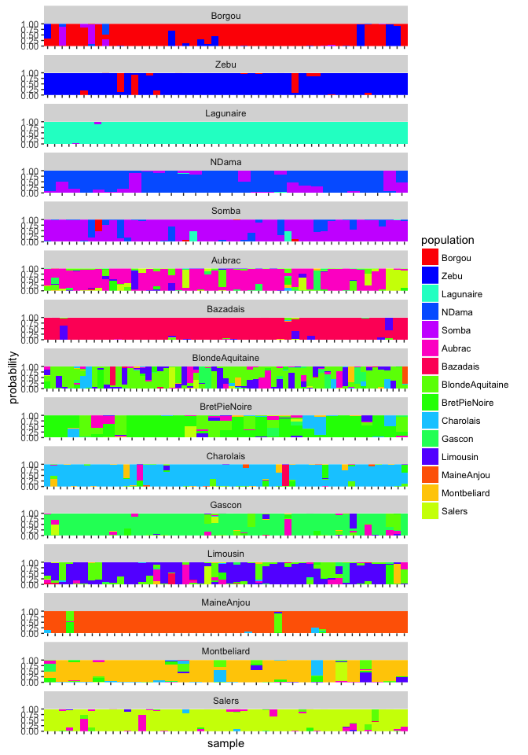
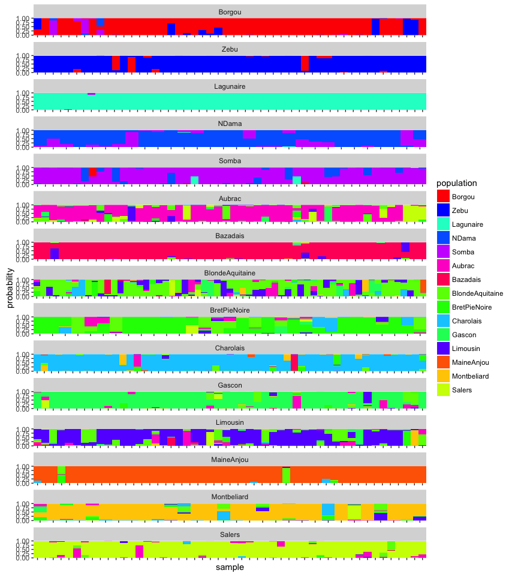
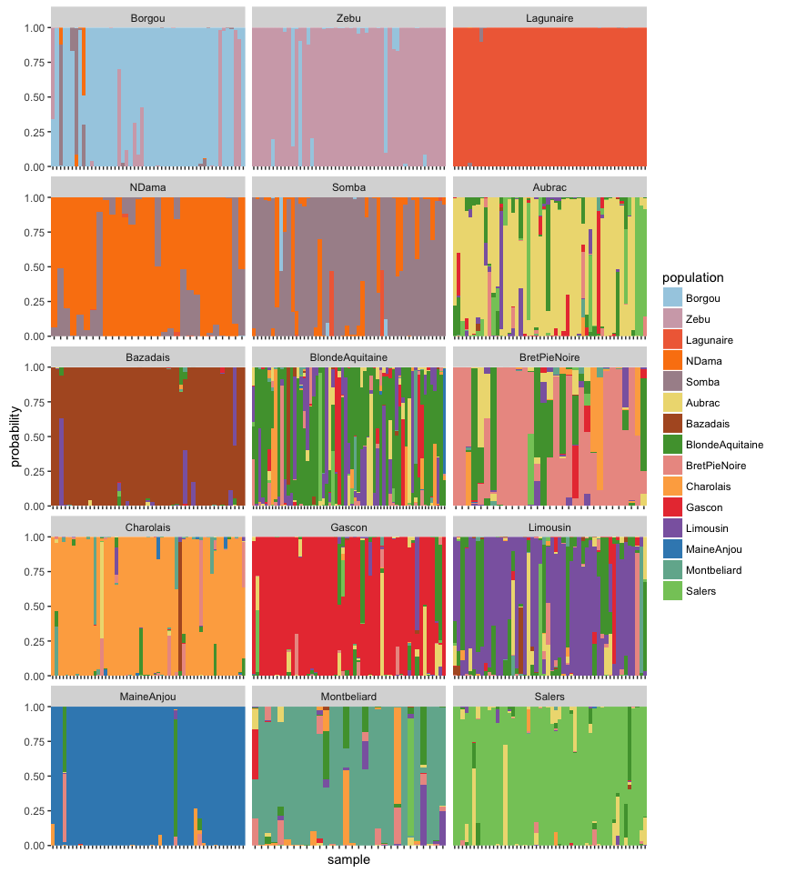
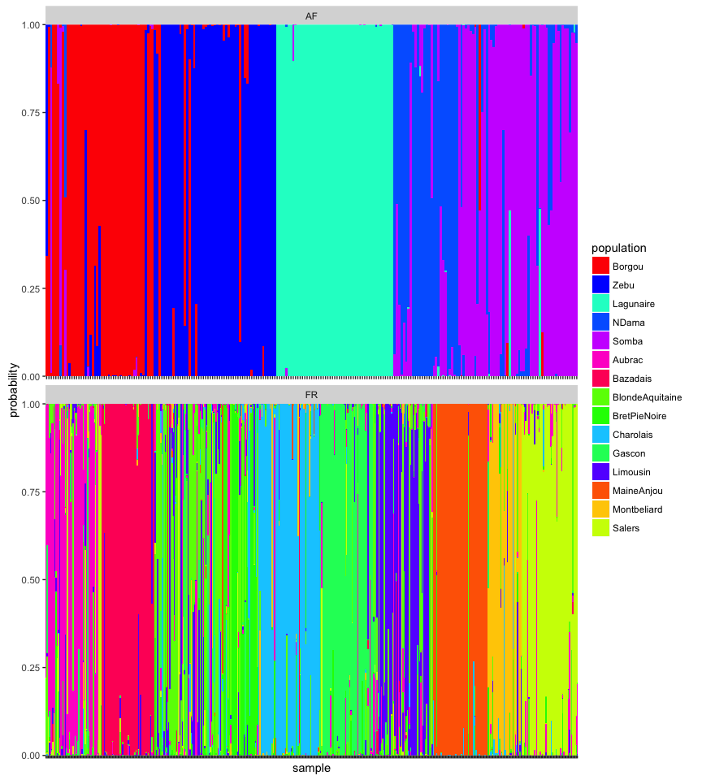

<!-- README.md is generated from README.Rmd. Please edit that file -->
ggcompoplot
===========

The goal of ggcompoplot is to create compoplots that can be manipulated using the grammar of graphics. This code originally appeared in <https://zenodo.org/record/13007>.

Installation
------------

To install, download devtools, and copy and past this into your R console:

``` r
devtools::install_github("zkamvar/ggcompoplot")
```

Example
-------

### Compoplot from DAPC Analysis (from adegenet)

``` r
library('adegenet')
#> Loading required package: ade4
#> 
#>    /// adegenet 2.0.1 is loaded ////////////
#> 
#>    > overview: '?adegenet'
#>    > tutorials/doc/questions: 'adegenetWeb()' 
#>    > bug reports/feature requests: adegenetIssues()
library('ggcompoplot')
library('ggplot2')
data(microbov)
strata(microbov) <- data.frame(other(microbov))
dapc1 <- dapc(microbov, n.pca=20, n.da=15)
compoplot(dapc1, lab="") # Adegenet compoplot
```



### Using ggcompoplot

To use ggcompoplot, all you need is the results of your DAPC analysis and your genind/genlight object:

``` r
ggcompoplot(dapc1, microbov) + theme(axis.text.x = element_blank())
```



``` r

# 3 columns
ggcompoplot(dapc1, microbov, col = 3) + theme(axis.text.x = element_blank())
```


``` r

# Different color palette
ggcompoplot(dapc1, microbov, col = 3, pal = funky) + theme(axis.text.x = element_blank())
```



``` r

# Per Country
setPop(microbov) <- ~coun
ggcompoplot(dapc1, microbov) + theme(axis.text.x = element_blank())
```


